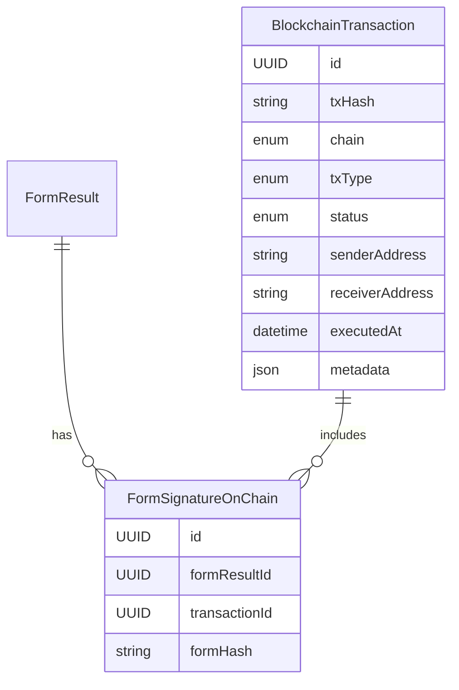

# 📦 Blockchain Transaction Schema Design (Flexible & Extensible)

This document describes a flexible database schema to store blockchain transaction data that supports multiple use cases (e.g., form signing, NFT issuance, reward transfers) and multiple blockchain platforms (e.g., Solana, Ethereum, Polygon).

---

## 🧱 1. `BlockchainTransaction` Table

This is the central table to record all blockchain transactions across different features.

| Field             | Type                                                   | Description                                           |
| ----------------- | ------------------------------------------------------ | ----------------------------------------------------- |
| `id`              | UUID                                                   | Primary key                                           |
| `txHash`          | String                                                 | Blockchain transaction hash                           |
| `chain`           | Enum (`SOLANA`, `POLYGON`, `ETHEREUM`, ...)            | Type of blockchain                                    |
| `txType`          | Enum (`FORM_SIGN`, `NFT_MINT`, `REWARD_TRANSFER`, ...) | Purpose of the transaction                            |
| `status`          | Enum (`PENDING`, `CONFIRMED`, `FAILED`)                | Transaction status                                    |
| `senderAddress`   | String                                                 | Wallet that initiated the transaction                 |
| `receiverAddress` | String (nullable)                                      | Destination wallet (if applicable)                    |
| `executedAt`      | DateTime (nullable)                                    | On-chain confirmed timestamp                          |
| `metadata`        | JSON                                                   | Dynamic metadata specific to the transaction use case |

---

## 🧾 2. `FormSignatureOnChain` Table

This table links approved form submissions with their corresponding blockchain transaction.

| Field           | Type                            | Description                                   |
| --------------- | ------------------------------- | --------------------------------------------- |
| `id`            | UUID                            | Primary key                                   |
| `formResultId`  | FK → `FormResult.id`            | ID of the form result submitted by a student  |
| `transactionId` | FK → `BlockchainTransaction.id` | Blockchain transaction that approved the form |
| `formHash`      | String                          | SHA-256 hash of the submitted form content    |

---

## 🔄 Entity Relationship Overview



---

## 🧠 Example `metadata` (JSON field)

```json
{
  "formId": "abc123",
  "formTitle": "Event Approval Request",
  "adminName": "Nguyen Van A"
}
```

---

## ✅ Benefits

- **Scalable**: supports multiple transaction types and blockchains.
- **Reusable**: a unified place to track on-chain events.
- **Modular**: new features can create their own tables and link to `BlockchainTransaction`.
- **Clean separation**: avoids bloating functional tables (like `FormResult`).

---

This schema is designed to support future extensions and centralized management of all blockchain interactions in your system.
